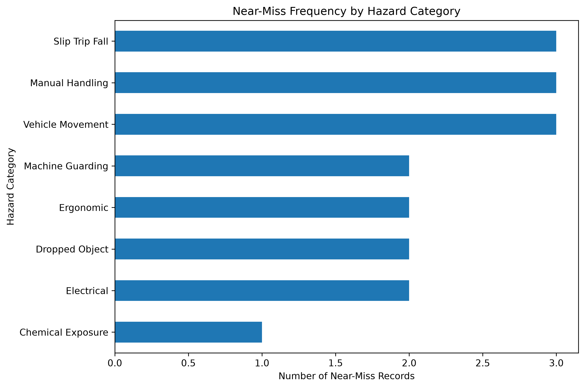
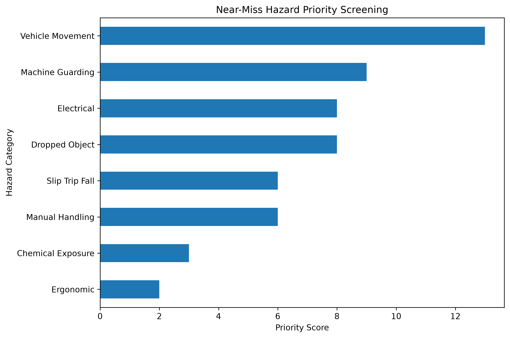

# HSE Near-Miss Analysis

A small reproducible HSE data-analysis project exploring near-miss frequency, severity, and hazard prioritization using a synthetic workplace dataset.

## Objective

This project explores:

1. Which hazard categories appear most frequently?
2. Which hazards have the highest average severity?
3. Which hazards should receive greater monitoring attention when frequency and severity are considered together?

## Dataset

The dataset contains synthetic near-miss records from several workplace areas, including:

- Workshop
- Warehouse
- Loading Bay
- Office

Hazard categories include:

- Manual Handling
- Slip, Trip and Fall
- Vehicle Movement
- Electrical
- Dropped Object
- Ergonomic
- Machine Guarding
- Chemical Exposure

The dataset is fictional and was created for learning and portfolio purposes.

## Method

Each near-miss record contains a severity value.

For each hazard category, the analysis calculates:

- Frequency
- Average severity
- Priority score

The descriptive priority score is calculated as:

`Priority Score = Frequency × Average Severity`

Hazards are then ranked from highest to lowest score.

## Important Note

This is **not a formal HIRARC, JSA, HAZOP, or quantitative risk assessment**.

The priority score is used only as a simple analytical screening method for this portfolio project.

A real workplace risk assessment would require additional information such as:

- Likelihood
- Exposure frequency
- Existing controls
- Residual risk
- Number of workers exposed
- Legal and regulatory requirements
- Actual workplace observations

## Visualizations

### Near-Miss Frequency by Hazard

### Hazard Priority Screening

## Files

`analysis.py`  
Contains the complete Python analysis.

`near_miss_data.csv`  
Contains the synthetic near-miss dataset.

`hazard_priority_summary.csv`  
Contains frequency, severity, priority score, and ranking.

`near_miss_by_hazard.png`  
Visualizes near-miss frequency.

`hazard_priority_score.png`  
Visualizes the descriptive priority score.

## Tools

- Python
- Pandas
- Matplotlib
- GitHub Codespaces

## Author

PenguinLogic